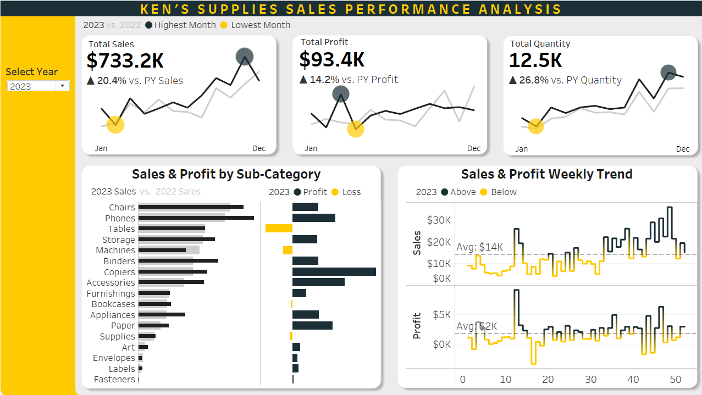

# Ken's Supplies Sales Performance Analysis – Tableau Dashboard Project

Interactive Tableau dashboard analyzing year-over-year sales, profit, and quantity by subcategory for Ken’s Supplies to support data-driven decisions and business growth.

## Project Overview 📋
This Tableau dashboard was created to help **Ken’s Supplies** better understand how their products are performing across different categories, regions, and time periods. The goal is to turn raw data into simple visuals that support smarter business decisions.

## Business Context 🏢

**Ken’s Supplies** is a major retailer of office supplies, furniture, and tech products. They offer a wide range of items like accessories, appliances, binders, copiers, and more. Ken’s Supplies is leveraging data analytics to optimize product offerings and ensure customer satisfaction. By using insights from sales data, they are driving innovation and enhancing product availability to remain competitive in today’s dynamic business environment.

## Problem Statement ❓

Ken’s Supplies aims to improve its understanding of sales performance across product subcategories, focusing on metrics such as sales revenue, profit, and quantity sold. The current challenge lies in identifying year-over-year trends in these metrics and analyzing how different product subcategories contribute to overall performance. Without a clear view of the sales trends and profit margins by subcategory, it’s difficult to make informed decisions regarding inventory management, pricing strategies, and future product investments.

## Rationale for the Project 🧠

To stay competitive in today’s market, Ken’s Supplies must have a thorough understanding of year-over-year sales performance and product trends. By analyzing key metrics like sales revenue, profit, and quantity sold across various product subcategories, we can identify growth opportunities and address underperforming areas.

## Project Objectives 🎯
- Provide an overview of year-over-year sales performance, focusing on sales revenue, profit, and quantity.
- Analyze sales trends, identifying top-performing and underperforming areas.
- Improve profitability and sales growth by understanding key performance metrics across product subcategories.
- Visualize sales metrics and trends using Tableau to present actionable insights to decision-makers.

## Data Sources 🗂️
I used four main datasets for this project, each in CSV format:

1. **Orders.csv** – Contains details of all Sales transactions. [dataset](Orders.csv) 

    Key Fields: Order ID, Ship Date, Customer ID, Product ID, Sales, Quantity, Discount, Profit, Segment

2. **Products.csv** - Links product IDs to their category and subcategory. [dataset](Products.csv) 

    Key Fields: Product ID, Category, Subcategory, Product Name

3. **Location.csv** - Contains geographical data of customers. [dataset](Location.csv)

    Key Fields: Postal Code, City, State, Region, Country

4. **Customers.csv** - Contains customer names and IDs. [dataset](Customers.csv)

    Key Fields: Customer ID, Customer Name

## Data Model & Relationships 🔗
All tables were connected using Tableau’s relationship model. These tables were linked using common fields:

- Orders ↔ Products (via Product ID)
- Orders ↔ Customers (via Customer ID)
- Orders ↔ Location (via Postal Code)

## Dashboard Features 📈

### KPI Summary Cards ✅
- Total Sales: $733.2K (+20.4% vs. PY)
- Total Profit: $93.4K (+14.2% vs. PY)
- Quantity Sold: 12.5K units (+26.8% vs. PY)
  
### Monthly KPI Trends 📊
- Line charts compare 2023 vs. 2022 sales, profits, and quantity by month
- Highlights highest and lowest performing months using markers
  
### Subcategory Comparison ↔️
- Horizontal bar charts for 2023 vs. 2022 sales by product subcategory
- Split views for profit and loss visualization by segment
  
### Weekly Sales & Profit Trend 📆
- Dual-axis line graphs of weekly data
- Visual indicators for above/below average performance
- Weekly average lines: $14K (sales), $2K (profit)

## Filter Options 🔍
- Year Selector: Choose any year to see performance
- Explore by product category, region, or customer segment

## Tools & Techniques Used 🛠️
- **Tableau Public** (.twbx)
- **Data Preparation**: Tableau’s relationship data modeling
- **Visualizations**: Built dashboard with bar charts, line charts, KPIs, and interactive filters
- Used calculated fields and simple formatting for clear storytelling

## Key Takeaways 📌
This dashboard helps Ken’s Supplies:
- Track performance in real time
- See which categories make the most profit
- Improve inventory and reduce customer loss
- Make smarter, data-based decisions

## Files Included 📂
- [Orders.csv](Orders.csv) (Main Table)
- [Products.csv](Products.csv)
- [Location.csv](Location.csv)
- [Customers.csv](Customers.csv)
- [Kens_Supplies_Dashboard.twbx](Kens_Supplies_Dashboard.twbx) – The Tableau workbook
- [Kens_Supplies_Dashboard.png](Kens_Supplies_Dashboard.png) – Dashboard image preview

## Live Preview or Demo 📍
To view the dashboard in Tableau Public, click [here](https://public.tableau.com/app/profile/chiamaka.okonkwo/viz/Kens_Supplies_Dashboard/Dashboard)

## Contact 📩
Created by **Chiamaka I. Okonkwo**
For questions, feel free to reach out or connect on [<ins>LinkedIn</ins>](https://www.linkedin.com/in/chiamaka-okonkwo42/)

